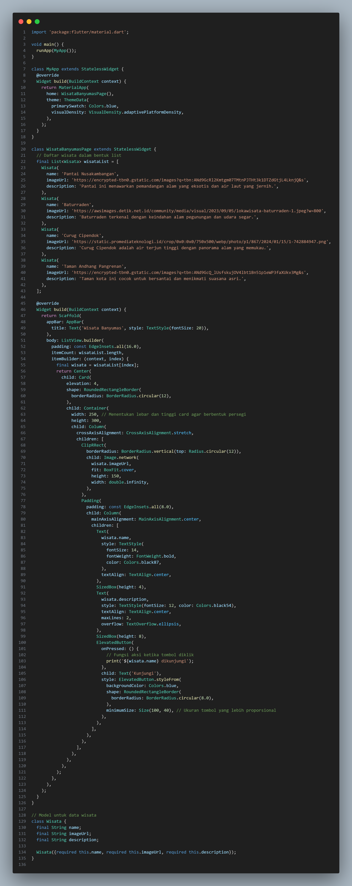

# Wisata Banyumas App
A simple Flutter application that displays a list of tourist destinations in Banyumas. Each destination is presented in a card format with an image, name, description, and a button to navigate further.

## Features
- Display a list of tourist attractions in Banyumas.
- Each card shows an image, name, and brief description of the place.
- A "Kunjungi" button for each tourist attraction, which can be linked to further actions.

## Source Code

## Output

## Description
The Wisata Banyumas App is a simple Flutter application that lists various tourist destinations in Banyumas, Indonesia. It displays information such as:

- Name: The name of the tourist place.
- Image: A visual representation (image) of the place.
- Description: A brief overview of what each location offers.
- Button: A "Kunjungi" button that, when pressed, can be extended to navigate users or trigger specific actions.

The app uses ListView and Card widgets to create a user-friendly layout. It also demonstrates the use of various Flutter components like Image.network, ElevatedButton, and custom models (Wisata) for managing the data structure.

Feel free to explore and customize the code further to fit your project needs or to add more functionality such as navigation to detailed pages or maps.
