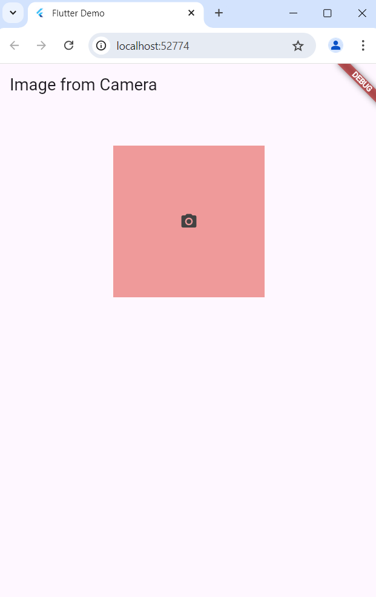

# Praktikum 09: API Perangkat Keras

## Deskripsi

Praktikum ini memanfaatkan API perangkat keras pada Flutter untuk mengakses fitur kamera dan galeri. Pengguna dapat memilih gambar dari galeri atau mengambil gambar langsung dari kamera menggunakan library `image_picker` dan `camera`.

---

## 1. Fitur Utama

### a. **Mengambil Gambar dari Kamera atau Galeri**

- Menggunakan library `image_picker` untuk mengambil gambar dari galeri atau kamera.
- Gambar yang dipilih ditampilkan di layar menggunakan widget `Image.file`.

### b. **Menggunakan Kamera dengan Preview**

- Library `camera` digunakan untuk menampilkan preview kamera secara real-time.
- Kamera pertama dari perangkat digunakan sebagai default.

---

## 2. Struktur Program

### a. File: `ImageFromGalleryEx`

Komponen ini menangani pengambilan gambar dari kamera atau galeri.

#### Penjelasan Kode

```dart
import 'dart:io';
import 'package:flutter/material.dart';
import 'package:image_picker/image_picker.dart';

class ImageFromGalleryEx extends StatefulWidget {
  final type; // Menentukan sumber gambar (kamera atau galeri)
  const ImageFromGalleryEx(this.type, {super.key});

  @override
  ImageFromGalleryExState createState() => ImageFromGalleryExState(this.type);
}

class ImageFromGalleryExState extends State<ImageFromGalleryEx> {
  var _image; // Variabel untuk menyimpan gambar yang dipilih
  var imagePicker; // Objek untuk mengakses image_picker
  var type;

  ImageFromGalleryExState(this.type);

  @override
  void initState() {
    super.initState();
    imagePicker = ImagePicker(); // Inisialisasi image_picker
  }

  @override
  Widget build(BuildContext context) {
    return Scaffold(
      appBar: AppBar(
        title: Text(
          type == ImageSource.camera ? "Image from Camera" : "Image from Gallery",
        ),
      ),
      body: Column(
        children: <Widget>[
          const SizedBox(height: 52),
          Center(
            child: GestureDetector(
              onTap: () async {
                var source = type == ImageSource.camera
                    ? ImageSource.camera
                    : ImageSource.gallery;
                XFile image = await imagePicker.pickImage(
                  source: source,
                  imageQuality: 50,
                  preferredCameraDevice: CameraDevice.front,
                );
                setState(() {
                  _image = File(image.path); // Simpan gambar yang dipilih
                });
              },
              child: Container(
                width: 200,
                height: 200,
                decoration: BoxDecoration(color: Colors.red[200]),
                child: _image != null
                    ? Image.file(
                        _image,
                        width: 200.0,
                        height: 200.0,
                        fit: BoxFit.fitHeight,
                      )
                    : Container(
                        decoration: BoxDecoration(color: Colors.red[200]),
                        width: 200,
                        height: 200,
                        child: Icon(
                          Icons.camera_alt,
                          color: Colors.grey[800],
                        ),
                      ),
              ),
            ),
          ),
        ],
      ),
    );
  }
}
```

**Fungsi Utama**:

- `ImagePicker` untuk mengambil gambar dari kamera atau galeri.
- Gesture pada container akan memicu pengambilan gambar.
- Gambar ditampilkan menggunakan widget `Image.file`.

---

### b. File: `MyApiPage`

Komponen ini menampilkan preview kamera dengan library `camera`.

#### Penjelasan Kode

```dart
import 'package:camera/camera.dart';
import 'package:flutter/material.dart';

class MyApiPage extends StatefulWidget {
  @override
  _MyApiPageState createState() => _MyApiPageState();
}

class _MyApiPageState extends State<MyApiPage> {
  late CameraController _controller;
  Future<void>? _initializeControllerFuture;

  @override
  void initState() {
    super.initState();
    _initializeControllerFuture = _initializeCamera();
  }

  Future<void> _initializeCamera() async {
    final cameras = await availableCameras();
    final firstCamera = cameras.first;

    _controller = CameraController(
      firstCamera,
      ResolutionPreset.medium,
    );

    await _controller.initialize(); // Inisialisasi kamera
  }

  @override
  void dispose() {
    _controller.dispose(); // Membersihkan resource kamera
    super.dispose();
  }

  @override
  Widget build(BuildContext context) {
    return Scaffold(
      appBar: AppBar(
        title: const Text("Api Perangkat Keras"),
        centerTitle: true,
        backgroundColor: const Color(0xFFFFD700),
      ),
      body: FutureBuilder<void>(
        future: _initializeControllerFuture,
        builder: (context, snapshot) {
          if (snapshot.connectionState == ConnectionState.done) {
            return CameraPreview(_controller); // Menampilkan preview kamera
          } else {
            return const Center(child: CircularProgressIndicator());
          }
        },
      ),
    );
  }
}
```

**Fungsi Utama**:

- `availableCameras()` untuk mendapatkan daftar kamera perangkat.
- `CameraController` digunakan untuk mengontrol kamera yang dipilih.
- Preview kamera ditampilkan dengan widget `CameraPreview`.

---

### c. Main Entry Point

```dart
import 'package:flutter/material.dart';

void main() {
  runApp(const MyApp());
}

class MyApp extends StatelessWidget {
  const MyApp({super.key});

  @override
  Widget build(BuildContext context) {
    return MaterialApp(
      title: 'Flutter Demo',
      theme: ThemeData(
        colorScheme: ColorScheme.fromSeed(seedColor: Colors.deepPurple),
        useMaterial3: true,
      ),
      home: MyApiPage(), // Halaman awal
    );
  }
}
```

---

## 3. Instalasi dan Konfigurasi

1. Tambahkan dependency berikut pada `pubspec.yaml`:
   ```yaml
   dependencies:
     image_picker: ^0.8.5+3
     camera: ^0.9.4+5
   ```
2. Pastikan menambahkan permission untuk kamera dan penyimpanan pada file `AndroidManifest.xml`:
   ```xml
   <uses-permission android:name="android.permission.CAMERA" />
   <uses-permission android:name="android.permission.READ_EXTERNAL_STORAGE" />
   <uses-permission android:name="android.permission.WRITE_EXTERNAL_STORAGE" />
   ```

---

## 4. Output



