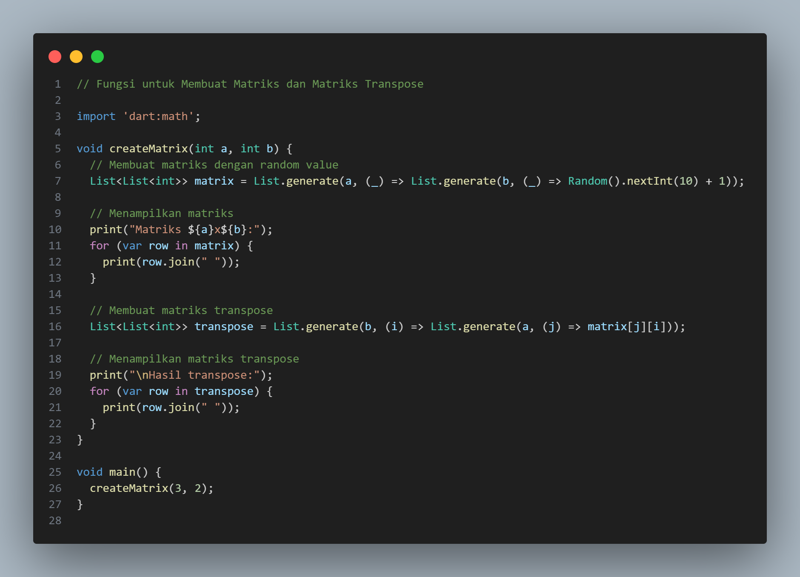
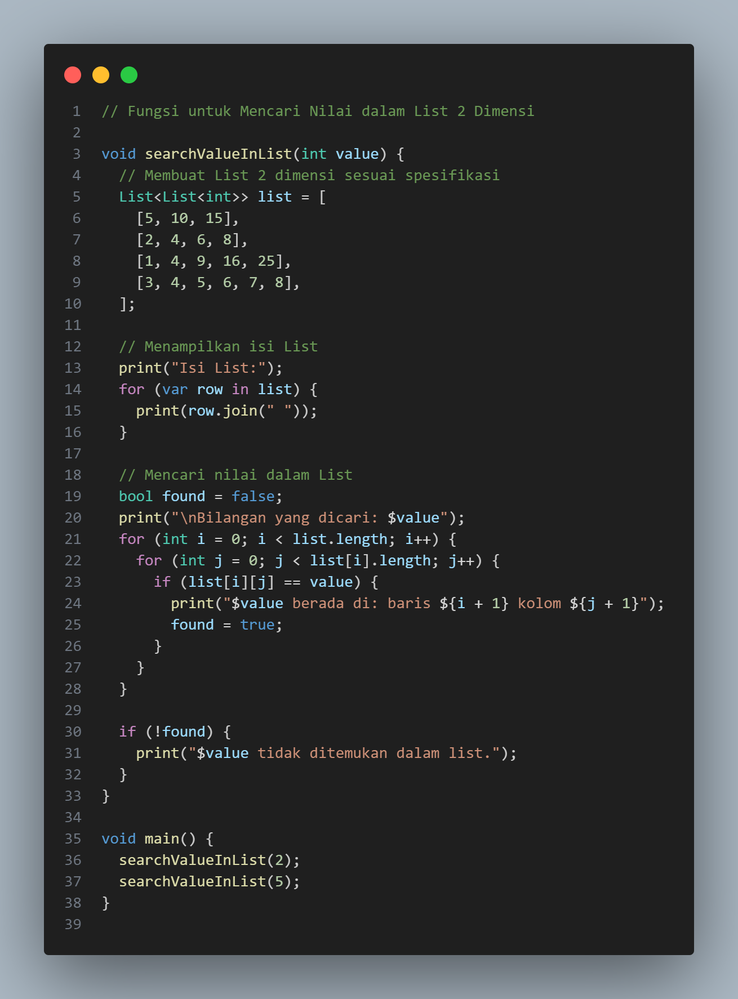
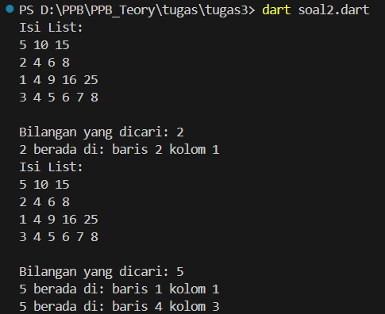
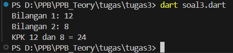

# Dart Operasi Matriks dan Bilangan

Proyek Dart ini berisi tiga fungsi yang melakukan operasi matriks, pencarian nilai dalam list 2 dimensi, dan perhitungan Kelipatan Persekutuan Terkecil (KPK) dari dua bilangan bulat. Fungsi-fungsi ini menunjukkan keterampilan dasar pemrograman Dart seperti penggunaan list, loop bersarang, dan perhitungan aritmatika.

## Fitur

1. <b>Pembuatan Matriks dan Transpose:</b> Membuat matriks dengan ukuran tertentu dan menampilkan transposenya.
2. <b>Pencarian Nilai dalam List 2 Dimensi:</b> Mencari nilai integer spesifik dalam list 2 dimensi yang sudah ditentukan dan menampilkan posisinya.
3. <b>Perhitungan KPK:</b> Menghitung Kelipatan Persekutuan Terkecil (KPK) dari dua bilangan bulat.

## Contoh Output

### 1. Pembuatan Matriks dan Transpose
Fungsi createMatrix membuat matriks dengan ukuran AxB dan menampilkan transposenya.

Kode Program

Output

### 2. Pencarian Nilai dalam List 2 Dimensi
Fungsi searchValueInList mencari nilai integer dalam list 2 dimensi dan menampilkan posisinya.

Kode Program

Output

### 3. Perhitungan KPK
Fungsi lcm menghitung KPK dari dua bilangan bulat.

Kode Program

Output

## Lisensi
Proyek ini dibuat dan dikembangkan oleh:

Nama: Nita Fitrotul Mar'ah
NIM: 2211104005
Kelas: RPL (Rekayasa Perangkat Lunak)